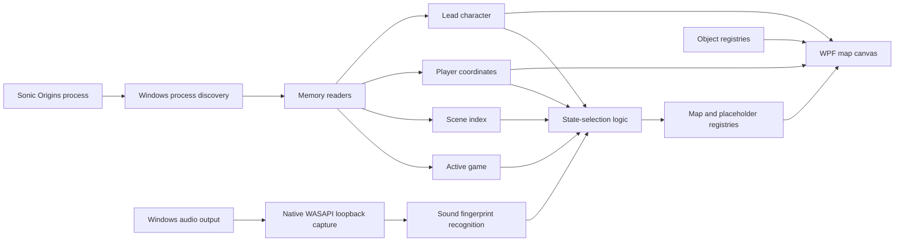
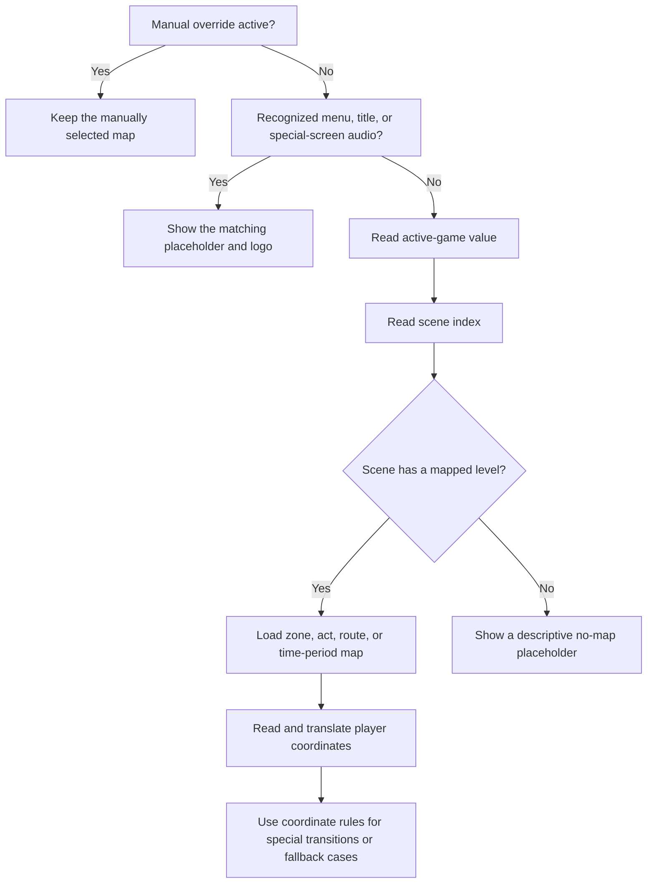

# Sonic Origins Mini Map

> A real-time, external minimap and object-tracking companion for the Windows version of **Sonic Origins**.

Sonic Origins Mini Map connects to a running copy of Sonic Origins, determines which supported game and level are active, reads the player's position, and displays that position on a full-level map. The application is designed to make the structure of classic Sonic stages easier to understand without modifying the game itself.

The tracker currently supports:

- **Sonic the Hedgehog**
- **Sonic CD**
- **Sonic the Hedgehog 2**
- **Sonic 3 & Knuckles**

It also includes character-specific player icons, automatic map switching, audio-based recognition for screens that cannot be identified reliably through level memory alone, zoomable and draggable map navigation, manual overrides, Sonic 3 & Knuckles Giant Ring tracking, and Sonic CD Past-object tracking.

> **IMAGE PLACEHOLDER — Main application screenshot**
> Add a screenshot showing the tracker connected to Sonic Origins, with a level map and character icon visible.

---

## Table of contents

- [Project goal](#project-goal)
- [The end product](#the-end-product)
- [Key features](#key-features)
- [How the tracker works](#how-the-tracker-works)
- [Detection system](#detection-system)
- [Map coordinate system](#map-coordinate-system)
- [Game-specific behavior](#game-specific-behavior)
- [User interface and controls](#user-interface-and-controls)
- [Installation](#installation)
- [How to use the application](#how-to-use-the-application)
- [Building from source](#building-from-source)
- [Tools and technologies](#tools-and-technologies)
- [Development process](#development-process)
- [Project structure](#project-structure)
- [Adding or correcting content](#adding-or-correcting-content)
- [Troubleshooting](#troubleshooting)
- [Known limitations](#known-limitations)
- [Privacy and security](#privacy-and-security)
- [Contributing](#contributing)
- [Credits and sources](#credits-and-sources)
- [Legal notice](#legal-notice)

---

## Project goal

Classic Sonic levels are much larger and more interconnected than the portion visible on screen at any one time. Their routes can cross, split, rejoin, loop vertically, or hide optional areas far outside the normal camera view. Conventional walkthroughs can show these layouts, but they do not show the player's current location in real time.

The goal of Sonic Origins Mini Map is to bridge that gap.

The project provides a companion window that answers three questions while the game is running:

1. **Which Sonic game, zone, act, and time period is currently active?**
2. **Where is the player located within the complete stage?**
3. **Which important optional objects are nearby or have already been collected?**

The application accomplishes this externally. It does not inject code into Sonic Origins, patch the executable, replace game files, or alter gameplay. It reads selected values from the running process and listens to the computer's game-audio output when audio recognition is required.

The larger design goal is to make exploration more approachable while preserving the original games. The tracker can help players learn stage layouts, locate alternate routes, understand vertical level design, practice navigation, or simply appreciate how the levels are assembled.

---

## The end product

The finished application is a Windows desktop companion built specifically for Sonic Origins. When launched alongside the game, it searches for the Sonic Origins process and connects automatically. Once connected, it identifies the active game and scene, loads the corresponding map, and updates the character's location at approximately 40 times per second.

During normal play, the map camera follows the character. The user can zoom in for a closer view, zoom out until the entire stage is visible, or drag the map to examine an area away from the character. A recenter button returns the view to the character and restores the standard zoom.

When the player is not in a conventional stage, the map is replaced by a clearly labeled placeholder display. This is used for states such as the Sonic Origins menu, title screens, Special Stages, Sonic 3 & Knuckles bonus stages, and Level Select. The appropriate game logo is shown so that the tracker never presents an unrelated stage map while the player is elsewhere.

> **IMAGE PLACEHOLDER — Full map view**
> Add a screenshot showing a complete stage at minimum zoom.

> **IMAGE PLACEHOLDER — Follow-camera view**
> Add a screenshot showing a close zoom with the character icon centered.

> **IMAGE PLACEHOLDER — Placeholder screen**
> Add a screenshot of the Sonic Origins menu, title-screen, or Special Stage placeholder.

---

## Key features

### Real-time position tracking

The application reads game-specific X and Y coordinates from Sonic Origins and converts them into the coordinate space of the displayed map. The position polling timer runs every 25 milliseconds, providing a target update rate of 40 Hz.

### Automatic game and map selection

The tracker identifies Sonic 1, Sonic CD, Sonic 2, and Sonic 3 & Knuckles. A shared scene index is then translated into a zone, act, route, or time-period definition through the internal scene registry.

### Character-specific icons

The lead-character value is read from memory and represented with a fixed-size icon for Sonic, Tails, Knuckles, or Amy. Combined-character selections, such as Sonic and Tails, use the lead character's icon. The icon remains the same visual size as the map zoom changes.

### Flexible map navigation

- Scroll-wheel zoom
- Dedicated zoom-in and zoom-out buttons
- Zoom range from a complete-stage overview to a very close view
- Click-and-drag map panning
- Automatic character following
- Recenter control

### Context-aware placeholder screens

Audio fingerprint recognition identifies important non-level states when scene memory alone is not sufficient. Supported examples include:

- Sonic Origins main menu
- Game title screens
- Sonic 1, Sonic CD, and Sonic 2 Special Stages
- Sonic 3 & Knuckles Blue Spheres
- Sonic 3 & Knuckles bonus stages
- Sonic 3 & Knuckles Level Select

### Sonic 3 & Knuckles Giant Rings

Known Giant Ring positions are stored in a dedicated registry and drawn as overlays on supported maps. When the character enters the configured interaction radius around a ring, its overlay disappears for the current visit to the map.

### Sonic CD Past-object tracking

Past versions of Sonic CD stages can display overlays for:

- Metal Sonic generators
- Robot transporters

The overlays disappear when the character reaches the corresponding object location, creating a lightweight visual record of the objects encountered during the current visit.

### Manual map override

The interface includes a manual selector for cases where automatic detection is ambiguous or the user wants to inspect a specific map. Automatic switching can be restored at any time.

---

## How the tracker works

The project is divided into a managed WPF application and a small native audio component.



### 1. Process discovery

The application searches for the running Sonic Origins process. When it finds the process, it opens a read-only connection used by the memory-reader classes.

If Sonic Origins is closed or restarted, the tracker releases the old process connection and attempts to reconnect. The default visual state is the Sonic Origins placeholder rather than an arbitrary level map.

### 2. Module-relative memory access

Most values are read using offsets relative to the loaded `SonicOrigins.exe` module. Module-relative offsets are preferable to session-specific absolute addresses because the executable's load location can change between runs.

Some values are reached through pointers in another loaded module. Dedicated reader classes isolate these details from the map and user-interface code.

The included Cheat Engine table is located at:

```text
Sonic_Tracker/assets/Addresses/SonicOrigins.CT
```

This table is provided as a research and debugging reference. The application itself does not require Cheat Engine to run.

### 3. Scene lookup

Sonic Origins uses a scene or level index that advances through each game's stage order. The `SceneIndexRegistry` translates the combination of active game and scene index into a descriptive scene.

A scene definition can include:

- Game
- Scene index
- Zone identifier
- Display name
- Act number
- Variant, route, phase, or time period
- Whether a conventional map exists

This approach resolves cases where multiple acts share the same starting coordinates. It also provides direct support for Sonic CD's Past, Present, Good Future, and Bad Future variants.

### 4. Position conversion

Each supported game exposes position data in a slightly different location. Game-specific position readers normalize those values into a shared `SonicPosition` representation.

The selected map definition can apply an X/Y translation so that the game's level coordinates align with the corresponding PNG. The application then converts the translated position into canvas coordinates.

The top-left corner of both the game level and the map image is treated as `(0, 0)`.

### 5. Rendering

The WPF interface renders the selected map image, character icon, and any active object overlays on coordinated canvases. A camera transform controls the current zoom and pan without changing the underlying map-coordinate system.

If a translated player position falls beyond the available map image—such as where a source map is horizontally cropped—the character icon is allowed to disappear instead of being forced into an incorrect location.

### 6. Audio recognition

The native C++ component captures Windows output audio through WASAPI loopback. The managed application fingerprints the captured audio and compares it with the included reference tracks using the SoundFingerprinting library.

Audio recognition is reserved for states where it provides useful information that memory alone cannot consistently distinguish. It is not used as the primary method for ordinary zone switching.

---

## Detection system

Several independent signals can describe the current game state. They are intentionally combined rather than forcing one method to solve every situation.



### Detection priority

The practical priority is:

1. **Manual override** when explicitly enabled by the user
2. **Recognized contextual audio** for menus, title screens, Special Stages, bonus stages, and Level Select
3. **Active-game and scene-index memory**
4. **Coordinate rules** for fallback detection and special transitions

Audio can temporarily supersede the normal memory-selected map because the scene index may remain on the previous level while a title screen or Special Stage is active. When the scene index changes again, ordinary map tracking resumes.

### Why more than one method is necessary

No single signal describes every state perfectly:

- Starting coordinates are sometimes identical across acts.
- Moving or auto-scrolling stages may not begin at a stable coordinate.
- Menu-state values can behave differently from normal in-game values.
- A scene index may remain unchanged during a temporary screen.
- Some levels reset their local coordinate system during a mid-level transition.

Combining scene memory, audio context, and coordinate rules produces more dependable behavior than relying on any one of them.

---

## Map coordinate system

The tracker uses a one-to-one pixel model wherever the source maps permit it:

```text
mapX = gameX + offsetX
mapY = gameY + offsetY
```

Offsets compensate for map images that begin at a different point than the game's internal level origin. They do not normally rescale the level. This preserves the relationship between movement in the game and movement on the map.

### Map calibration process

Maps were calibrated by comparing a known in-game debug coordinate with the same visible location on the corresponding PNG:

1. Stand at a recognizable location in the game.
2. Record the in-game X and Y values.
3. Find the same point on the map image.
4. Record the map-image pixel coordinates.
5. Calculate the translation between the two points.
6. Test the translation at additional locations across the stage.
7. Store the final values in the map definition.

This process also reveals whether a map has a true scaling problem or only an origin offset.

### Angel Island Zone Act 1

Angel Island Act 1 is a special case. After the fire transition, the game changes to a different local coordinate space while the displayed map continues into the second half of the stage.

The tracker recognizes this transition and switches between two phases:

- **Normal**
- **Burnt**

The Burnt phase applies a second coordinate translation so the character continues across the same full-stage map. Both phases are also available through the manual override for players who begin directly in the second half.

---

## Game-specific behavior

### Sonic the Hedgehog

- Tracks all regular zones and acts through Final Zone.
- Uses scene-index memory as the primary act selector.
- Includes coordinate-based fallback data for ambiguous starting positions.
- Displays a dedicated placeholder for recognized Special Stages and the title screen.

### Sonic CD

- Supports the game's zone and act structure.
- Distinguishes Past, Present, Good Future, and Bad Future maps.
- Displays Metal Sonic generator and robot transporter overlays on supported Past maps.
- Removes object overlays after the character interacts with their locations.
- Uses placeholders for the title screen and Special Stage.

> **IMAGE PLACEHOLDER — Sonic CD object overlays**
> Add a screenshot of a Past map containing generator and robot transporter icons.

### Sonic the Hedgehog 2

- Supports regular zones, including Metropolis Act 3, Wing Fortress, Death Egg, and the Hidden Palace entry represented by the scene index.
- Sky Chase uses a no-map placeholder because its continuously moving level structure does not translate into a useful static minimap.
- Includes title-screen and Special Stage placeholders.

### Sonic 3 & Knuckles

- Supports the complete scene-index sequence from Angel Island through Doomsday.
- Treats the Lava Reef final boss and Death Egg final boss as separate scenes.
- Distinguishes Sonic and Knuckles routes through Sky Sanctuary.
- Handles the Normal/Burnt coordinate transition in Angel Island Act 1.
- Displays known Giant Ring locations and removes rings after interaction.
- Recognizes Blue Spheres, bonus-stage types, Level Select, and the title screen.

> **IMAGE PLACEHOLDER — Sonic 3 & Knuckles Giant Rings**
> Add a screenshot showing Giant Ring overlays on a stage map.

---

## User interface and controls

### Connection status

The top status area reports whether the tracker is searching for Sonic Origins or connected to a specific process ID.

### Map viewport

The central viewport contains the current map or placeholder screen. During normal automatic tracking, the camera follows the character.

### Zoom controls

- Use the **mouse wheel** over the map to zoom in or out.
- Select **+** to zoom in.
- Select **−** to zoom out.
- The minimum zoom is calculated so the complete map can be viewed.
- The maximum zoom is intentionally high for close inspection.

### Panning

Click and drag inside the map viewport to inspect a location away from the character. Manual panning temporarily allows the camera to remain away from the automatic follow position.

### Recenter

Select **Recenter** to restore the normal camera zoom and center the view on the character.

### Manual map override

Choose a map from the override list and select **Apply** to hold that map on screen. Select **Auto** to clear the override and resume automatic switching.

The override is particularly useful for:

- Testing map calibration
- Entering a stage through an unusual route
- Starting in the Burnt half of Angel Island Act 1
- Recovering temporarily from an unrecognized scene

### Status information

The lower status panel reports the current map, game, translated position, raw coordinates, audio-recognition state, and the latest map-state message. New map messages replace the previous message rather than creating an ever-growing log.

---

## Installation

### Recommended: packaged release

1. Open the repository's **Releases** page.
2. Download `Sonic-Origins-Mini-Map-v1.0.0-win-x64.zip`.
3. Extract the complete ZIP to a folder.
4. Do not move the executable away from the other extracted files.
5. Start Sonic Origins.
6. Run `Sonic_Tracker.exe`.

The packaged Windows x64 release is self-contained. A separate .NET runtime installation should not be necessary.

### System requirements

- Windows 10 or Windows 11, 64-bit
- The Windows/Steam version of Sonic Origins
- A display large enough to keep the tracker visible beside or above the game
- Game audio available through the Windows output device when audio recognition is used

### Windows security prompt

Because this is an independently distributed application, Windows may display a SmartScreen warning. Verify that the file was downloaded from this repository before choosing to run it.

---

## How to use the application

1. Launch Sonic Origins and wait for the main menu.
2. Launch Sonic Origins Mini Map.
3. Confirm that the status area reports a connection to `SonicOrigins`.
4. Enter one of the four supported games.
5. Begin a level and verify that the correct zone and act appear.
6. Use the zoom and pan controls as desired.
7. Select **Recenter** whenever you want to return to automatic character-centered viewing.
8. If the wrong map is displayed, select the correct map through the manual override and record the circumstances for a bug report.

For the best audio-recognition results, avoid muting game music while entering a supported menu, title screen, Special Stage, or bonus stage.

---

## Building from source

### Prerequisites

- Visual Studio 2022
- .NET 8 SDK
- Desktop development with .NET workload
- Desktop development with C++ workload
- Windows 10 or Windows 11 SDK
- x64 build tools

### Build procedure

1. Clone the repository.
2. Open `Sonic_Tracker.sln` in Visual Studio.
3. Select the `x64` platform.
4. Select either `Debug` or `Release`.
5. Build the complete solution.

The solution contains two projects:

- `Sonic_Tracker` — the .NET 8 WPF application
- `SonicTracker.NativeAudio` — the native Windows audio-capture DLL

The managed project depends on the native project. After a successful build, the project file copies `SonicTracker.NativeAudio.dll` into the managed output directory.

### Command-line managed build

After the native Release DLL exists, the managed project can be built with:

```powershell
dotnet build .\Sonic_Tracker\Sonic_Tracker.csproj -c Release -p:Platform=x64
```

### Publishing a self-contained Windows build

An example publish command is:

```powershell
dotnet publish .\Sonic_Tracker\Sonic_Tracker.csproj `
  -c Release `
  -r win-x64 `
  --self-contained true `
  -p:PublishSingleFile=false `
  -p:DebugType=None `
  -p:DebugSymbols=false
```

Confirm that `SonicTracker.NativeAudio.dll` is present beside `Sonic_Tracker.exe` in the final package.

### Audio packaging

The source tree retains reference audio used during development. The project file excludes obsolete zone tracks and other unused temporary tracks from Release output to reduce the distributed package size. The audio-recognition code remains available for the contextual tracks that are still part of the runtime design.

---

## Tools and technologies

### Application development

| Tool or technology | Role in the project |
|---|---|
| C# | Main application logic, memory readers, map registries, detection state, and UI behavior |
| .NET 8 | Managed application runtime |
| WPF and XAML | Desktop user interface, canvases, controls, transforms, and image rendering |
| Visual Studio 2022 | Solution management, compilation, debugging, and profiling |
| MSBuild | Managed/native solution orchestration and output copying |
| NuGet | Managed dependency restoration |

### Memory and process research

| Tool or technology | Role in the project |
|---|---|
| Windows process APIs | Finding Sonic Origins and reading selected process memory |
| Module-relative offsets and pointers | Locating stable game, scene, position, and character state |
| Cheat Engine | Researching values, testing pointer stability, and validating coordinate behavior |
| Included `.CT` table | Preserving useful address research for future maintenance |

### Audio recognition

| Tool or technology | Role in the project |
|---|---|
| C++ | Native audio-capture bridge |
| WASAPI loopback capture | Reading the audio currently playing through Windows |
| SoundFingerprinting | Creating and matching fingerprints for known game-state audio |
| WAV reference files | Recognition samples for supported menus and special screens |

### Maps and visual assets

| Tool or technology | Role in the project |
|---|---|
| PNG level maps | Full-stage visual backgrounds |
| Image-editing software | Cleaning map images, removing baked-in objects, preparing transparent overlays, and measuring pixel coordinates |
| In-game debug coordinates | Matching game positions to map pixels |
| WPF transforms | Camera following, zooming, and panning |

### Source control and distribution

| Tool or technology | Role in the project |
|---|---|
| Git | Version history and source management |
| GitHub | Repository hosting, issue tracking, and release distribution |
| Self-contained .NET publishing | Producing a Windows package that includes its required managed runtime |

---

## Development process

The tracker was developed iteratively, starting with a small proof of concept and expanding as more stable signals and better map assets became available.

### Phase 1: basic Sonic 2 position tracking

The first objective was to connect to Sonic Origins, read Sonic 2's player coordinates, and place a marker on an Emerald Hill map. This established the process-reader, map canvas, and coordinate-update loop.

### Phase 2: map and act switching

Early act switching relied heavily on known starting coordinates. A registry of starting positions allowed the tracker to infer an act after a large coordinate change. This worked well for many Sonic 2 stages but exposed an important limitation: some acts and games reuse identical starting coordinates.

### Phase 3: stable scene-index detection

Research identified a shared scene value used by Sonic 1, Sonic 2, Sonic CD, and Sonic 3 & Knuckles. The value advances through each game's stage order. This became the primary level and act signal, while coordinate matching remained useful as a fallback and for unusual transitions.

### Phase 4: multi-game support

Separate position readers were added for:

- Sonic 1 and Sonic 2
- Sonic CD
- Sonic 3 & Knuckles

The game-state reader selects the correct position reader at runtime. Registries were expanded to describe the complete supported scene order and associate each scene with the correct map.

### Phase 5: map calibration

Maps from different sources did not always share the game's coordinate origin. Each problematic stage was tested with known game coordinates and measured map pixels. Translation offsets were added where needed.

Several maps were replaced when the original images introduced scaling errors. The final approach favors maps with a one-to-one relationship between game movement and image pixels, leaving only an X/Y translation to calibrate.

### Phase 6: camera and usability

The original whole-map display made large stages difficult to read. A camera system was added with character following, fixed-size icons, scroll-wheel zoom, button zoom, complete-map zoom-out, drag panning, and recentering.

### Phase 7: contextual audio recognition

Some states do not behave like ordinary levels. Native WASAPI loopback capture and sound fingerprinting were introduced to recognize menu, title, Special Stage, bonus-stage, and Level Select music. Placeholder displays prevent stale level maps from remaining visible during those states.

### Phase 8: game-specific object overlays

The map system was extended beyond player position:

- Sonic 3 & Knuckles Giant Ring positions were catalogued.
- Sonic CD Past generators and robot transporters were catalogued.
- Interaction-radius logic removes an overlay after the player reaches it.

### Phase 9: release cleanup

The final cleanup focused on:

- Removing obsolete test controls
- Replacing temporary UI elements with game logos
- Using a dedicated application icon
- Reducing Release audio size
- Including a Cheat Engine reference table
- Producing a self-contained Windows x64 package

---

## Project structure

```text
Sonic_Tracker/
├── README.md
├── Sonic_Tracker.sln
├── Sonic_Tracker/
│   ├── App.xaml
│   ├── MainWindow.xaml
│   ├── MainWindow.xaml.cs
│   ├── Audio/
│   │   ├── Capture/
│   │   └── SoundFingerprintRecognitionService.cs
│   ├── Games/
│   ├── Maps/
│   ├── memory/
│   └── assets/
│       ├── Addresses/
│       ├── Audio/
│       ├── Images/
│       └── Maps/
└── SonicTracker.NativeAudio/
    ├── NativeAudioApi.cpp
    ├── NativeAudioApi.h
    └── SonicTracker.NativeAudio.vcxproj
```

### Important components

| Component | Responsibility |
|---|---|
| `MainWindow.xaml` | Main WPF layout |
| `MainWindow.xaml.cs` | Application state, camera controls, switching logic, overlays, and user interaction |
| `MemoryReader` | Low-level process-memory access |
| Game-specific readers | Normalizing player positions for each game |
| `OriginsGameStateReader` | Determining which game is active |
| `OriginsSceneIndexReader` | Reading the current scene index |
| `OriginsCharacterReader` | Reading the selected lead character |
| `SceneIndexRegistry` | Translating scene values into game locations |
| `ZoneMapRegistry` | Connecting location definitions to PNG maps and calibration data |
| `Sonic3KBigRingRegistry` | Known Giant Ring locations |
| `SonicCDPastObjectRegistry` | Known generator and robot transporter locations |
| `SoundFingerprintRecognitionService` | Building and matching audio fingerprints |
| `SonicTracker.NativeAudio` | Capturing Windows output audio through WASAPI |

---

## Adding or correcting content

### Adding a new map

1. Place the PNG in the appropriate game directory under `Sonic_Tracker/assets/Maps`.
2. Add or update its path in `MapPaths`.
3. Add a `ZoneMapDefinition` in `ZoneMapRegistry`.
4. Add the corresponding scene entry in `SceneIndexRegistry` if necessary.
5. Confirm that the image uses the expected top-left origin.
6. Calibrate the player offset with at least two widely separated test points.
7. Test minimum zoom, maximum zoom, panning, recentering, and off-map behavior.

### Correcting an offset

Record one point in both coordinate spaces:

```text
offsetX = mapPixelX - gamePixelX
offsetY = mapPixelY - gamePixelY
```

Test the result at the start, middle, and end of the map. If the error grows with distance, the image has a scaling problem and should be replaced or rescaled rather than corrected with a larger offset.

### Adding an object overlay

1. Prepare a transparent PNG for the object.
2. Remove the original baked-in object from the underlying map when appropriate.
3. Record the object's map-pixel anchor.
4. Add the location to the appropriate registry.
5. Render it on the overlay canvas.
6. Define an interaction area that matches how the object is used in-game.
7. Test collection from multiple approach directions.

### Adding an audio-recognized state

1. Add a clean WAV reference to the correct audio directory.
2. Create an `AudioTrackDefinition` in the correct game profile.
3. Assign an appropriate `AudioTrackKind`.
4. Decide whether recognition should show a placeholder, change the active game, or temporarily pause normal scene switching.
5. Test with different Windows volume levels and with nearby tracks that could produce a false match.

---

## Troubleshooting

### The tracker stays on the Sonic Origins placeholder

- Confirm Sonic Origins is running.
- Confirm the tracker reports that it is connected to a process ID.
- Start the tracker after Sonic Origins if automatic reconnection does not occur.
- Verify that the game executable is the supported Windows version.

### The wrong map appears

- Clear any active manual override.
- Wait for the next scene change.
- Use the manual selector as a temporary workaround.
- Report the game, zone, act, route/time period, character, and displayed raw values.

### The character icon is offset

- Confirm the correct act and map variant are selected.
- Test whether the offset remains constant across the level.
- A constant error suggests an incorrect translation.
- An error that grows across the stage suggests a scaling mismatch in the source map.

### The character icon disappears

This may be intentional when the source map image ends before the game level's full coordinate range. It can also occur if a stage offset needs correction.

### Audio placeholders do not appear

- Confirm game audio is playing through the active Windows output device.
- Do not mute the music during the transition.
- Confirm `SonicTracker.NativeAudio.dll` is beside the application executable.
- Keep the included WAV assets in their packaged directory structure.
- Try restarting the tracker after changing audio devices.

### The map camera does not follow the character

Select **Recenter**. Dragging the viewport intentionally allows the camera to remain away from the character until it is recentered.

### The application does not start

- Extract the entire release rather than running the executable from inside the ZIP.
- Keep all files together.
- Confirm the operating system is 64-bit Windows.
- If building from source, install both the .NET desktop and C++ desktop workloads.

---

## Known limitations

- Memory layouts can change after a Sonic Origins update. Module-relative offsets are more stable than absolute addresses, but they are not guaranteed to remain valid forever.
- The current build is intended for the Windows/Steam release of Sonic Origins.
- Sky Chase Zone does not use a conventional static map because the character and level advance through an auto-scrolling structure.
- Audio recognition depends on audible game output and may be affected by device changes, muted music, overlapping audio, or heavily modified game audio.
- Object disappearance is based on proximity to known map coordinates. It does not read the game's permanent save data.
- Collected-object state is maintained for the current map visit rather than as a complete save-file inventory.
- A cropped source map can cause the character icon to disappear near the physical end of the available image.
- The tracker is a companion display, not an in-game overlay injected into Sonic Origins.

---

## Privacy and security

The tracker reads a limited set of values from the local Sonic Origins process and captures local Windows output audio for in-memory fingerprint comparison.

The project is not designed to:

- Modify Sonic Origins memory
- Send input to the game
- Upload captured audio
- Record microphone input
- Collect account credentials
- Transmit gameplay data to an external service

Users should download builds only from this repository's official Releases page and may build the application from source for additional verification.

---

## Contributing

Contributions and detailed bug reports are welcome.

Useful issue reports should include:

- Sonic game
- Zone and act
- Sonic CD time period, if applicable
- Sonic 3 & Knuckles route or Angel Island phase, if applicable
- Selected character
- Expected map
- Actual map
- Raw and displayed coordinates
- Screenshot of the tracker
- Whether automatic selection or manual override was active
- Steps required to reproduce the problem

For map corrections, include at least one clearly identified point with both the in-game coordinate and the map-image pixel coordinate.

---

## Credits and sources

> [Sonic Galaxy](https://www.sonicgalaxy.net/maps/) for Sonic 2 and CD maps

>[Sonic Retro](https://sonicretro.org/) for Sonic 3K maps

>[Rayden](https://steamcommunity.com/sharedfiles/filedetails/?id=2488962511) for Sonic 1 maps


### Third-party software

- [SoundFingerprinting](https://github.com/AddictedCS/soundfingerprinting) — audio fingerprint creation and matching
- [.NET](https://dotnet.microsoft.com/) — managed runtime and development platform
- [Windows Presentation Foundation](https://learn.microsoft.com/dotnet/desktop/wpf/) — desktop user-interface framework
- [Windows Audio Session API](https://learn.microsoft.com/windows/win32/coreaudio/wasapi) — Windows loopback audio capture

Before publishing final credits, verify the licenses and attribution requirements of all third-party code and visual/audio assets included in the repository and Release package.

---

## Legal notice

Sonic Origins Mini Map is an unofficial, fan-made companion project. It is not affiliated with, endorsed by, sponsored by, or approved by SEGA.

Sonic the Hedgehog, Sonic Origins, related game titles, characters, logos, music, artwork, and other associated materials are trademarks or copyrighted works of their respective owners.

This repository should document the source and permitted use of all included maps, images, and audio reference material. Project contributors are responsible for ensuring that distributed assets comply with applicable licenses and permissions.
